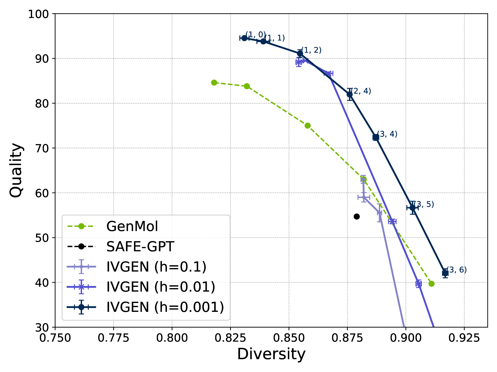
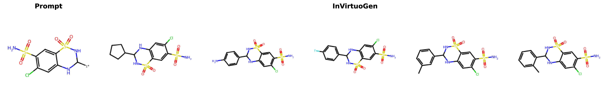
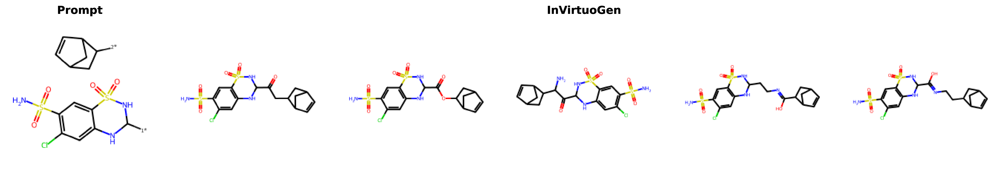
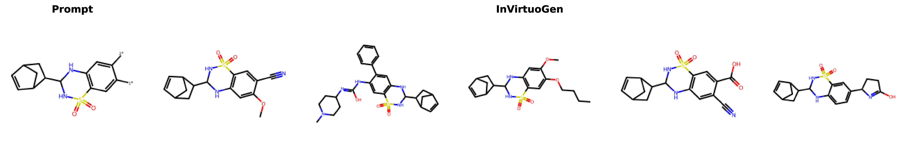
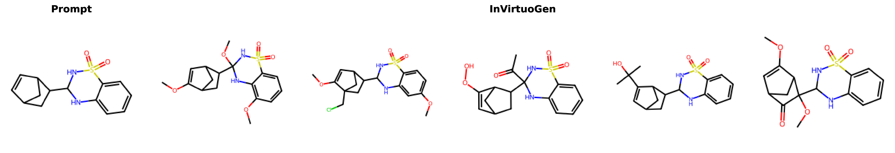

# InVirtuoGen: Uniform-Source Discrete Flows for Drug Discovery

**State-of-the-art discrete flow model for fragment-based molecular generation and optimization**

## 🚀 Quick Start

### Setup Environment
For ARM-based
```bash
mamba create -n invgen python=3.10.16 -y
mamba activate invgen
pip install -r requirements.txt
pip install -e .
```
For aarch64, use the provided Dockerfile
### Download Checkpoints
```bash
mkdir checkpoints && cd checkpoints
curl https://zenodo.org/api/records/16874868/files-archive -o checkpoints.zip
unzip checkpoints.zip && unzip invirtuo_gen_big.ckpt.zip && unzip invirtuo_gen.ckpt.zip
cd ..
```

**Available Models:**
- `invirtuo_gen.ckpt` - Standard model for general use
- `invirtuo_gen_big.ckpt` - Larger model for optimal performance

## 🧪 Core Capabilities

### 1. De Novo Molecule Generation
Generate novel drug-like molecules with controllable quality-diversity trade-offs.

**Quick Generation:**
```bash
python -m in_virtuo_gen.generate \
    --ckpt_path checkpoints/invirtuo_gen.ckpt \
    --num_samples 1000 \
    --batch_size 200
```

**Reproduce Quality-Diversity Analysis:**

(~6h on RTX 4090 for 3 seeds)
```bash
python -m in_virtuo_gen.evaluation.denovo \
    --outdir plots \
    --checkpoint_path checkpoints/invirtuo_gen_big.ckpt \
    --dt 0.1 0.01 0.001 \
    --num_samples 1000 \
    --eta 999 \
    --num_seeds 3 \
    --device 0
```

### 2. Fragment-Constrained Generation
(<1h on RTX 4090 for 3 seeds)

Design molecules containing specific fragments while optimizing properties.




```bash
python -m in_virtuo_gen.evaluation.downstream \
    --model_path checkpoints/invirtuo_gen.ckpt \
    --dt 0.001 \
    --temperature 1 \
    --all \
    --noise 0 \
    --eta 1 \
    --device 0
```

**Supported Tasks:**
- **Motif Extension** - Growing fixed motifs with new substituents
- **Linker Design** - Connecting fragments with feasible linkers
- **Scaffold Decoration** - Adding functional groups at defined positions
- **Superstructure Generation** - Assembling multiple fragments

### 3. Target Property Optimization
Optimize molecular properties using genetic algorithms + reinforcement learning.

**Setup:**
```bash
mkdir -p data
wget -O data/frags_zinc250.csv https://zenodo.org/records/16742898/files/frags_zinc250.csv
python -m in_virtuo_reinforce.preprocess.get_vocab \
    --datapath data/frags_zinc250.csv \
    --outpath in_virtuo_reinforce/vocab/zinc250k.csv
```

**Run Optimization (~36h on RTX 4090 for 3 seeds):**
```bash
# Standard benchmark
python -m in_virtuo_reinforce.genetic_ppo \
    --device 0 --start_t 0.0 --offspring_size 100 \
    --max_oracle_calls 10000 --num_reinforce_steps 30 \
    --clip_eps 0.2 --use_prompter --use_mut --train_mut \
    --dt 0.01 --experience 28

# With ZINC250k prescreening
python -m in_virtuo_reinforce.genetic_ppo \
    --device 0 --start_t 0.0 --offspring_size 100 \
    --max_oracle_calls 10000 --num_reinforce_steps 10 \
    --clip_eps 0.5 --use_prompter --use_mut --train_mut \
    --dt 0.01 --experience 28 --use_prescreen
```

### 4. Lead Optimization:
(We were unable to install the required dependencies for these experiments in the Dockerfile on an aarch64 environment. On ARM systems, the setup works by simply running pip install -r requirements.txt).
```bash
 python -m in_virtuo_reinforce.ppo_docking --device 0 --start_t 0.\
  --offspring_size 20 --seed 0 --max_oracle_calls 1000 --num_reinforce_steps 50\
   --clip_eps 0.5 --start_task 0 --experience_replay_size 100\
    --dt 0.01 --c_neg 1 --dt 0.01 --tot_offspring 100
```


**Key Advantages:**
- **Uniform Source Distribution** - Enables global iterative refinement vs. autoregressive/masked completion
- **Decoupled Sampling** - Number sampling steps independent of sequence length
- **Fragment-Level Control** - Direct manipulation of chemically meaningful substructures
- **Integrated Optimization** - Seamless GA + PPO for property-targeted generation and lead optimization

**Architecture:**
- Discrete flows model with diffusion transformer backbone
- Fragmented SMILES with numbered attachment points `[1*], [2*], [3*]`
- Character-level tokenization (204-token vocabulary)
- Bidirectional attention for context modeling


## 📄 Citation

To BE DONE

## 📧 Contact


Reproducing results:
 PPO With Prescreening:
 python -m in_virtuo_reinforce.evaluation.results_table --results_root results/target_property_optimization/775216 --incl

 python -m in_virtuo_reinforce.evaluation.results_table --results_root results/target_property_optimization/778165  --incl --excl
python  -m in_virtuo_reinforce.evaluation.results_table --ablation_mode \
  --results_paths results/target_property_optimization/780605_no_mutation results/target_property_optimization/779949_no_mut_no_exp_replay results/target_property_optimization/773771_no_ppo results/target_property_optimization/772670_no_prompter_no_prescreen_no_mut  \
  --model_names "No Mutation" "No Mutation, No Replay" "No PPO" "No Prompter, No Mutation, No Prescreen"