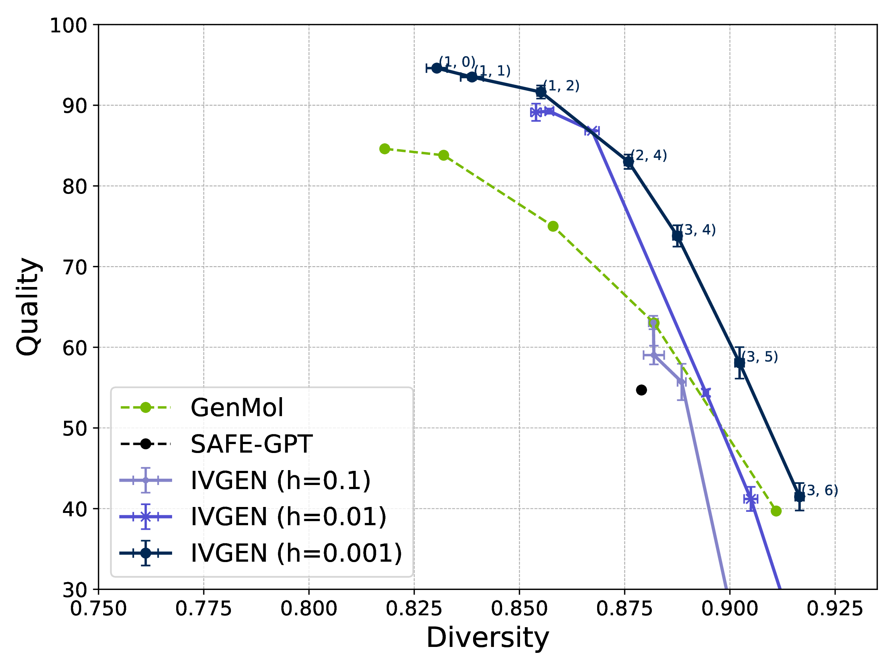

# InVirtuoGen: Uniform-Source Discrete Flows for Drug Discovery

**State-of-the-art discrete flow model for fragment-based molecular generation and optimization**

## 🚀 Quick Start

### Setup Environment
```bash
mamba create -n invgen python=3.10.16 -y
mamba activate invgen
pip install -r requirements.txt
pip install -e .
```

### Download Checkpoints
```bash
mkdir checkpoints && cd checkpoints
curl https://zenodo.org/api/records/16874868/files-archive -o checkpoints.zip
unzip checkpoints.zip && unzip invirtuo_gen_big.ckpt.zip && unzip invirtuo_gen.ckpt.zip
cd ..
```

**Available Models:**
- `invirtuo_gen.ckpt` - Standard model for general use
- `invirtuo_gen_big.ckpt` - Larger model for optimal performance

## 🧪 Core Capabilities

### 1. De Novo Molecule Generation
Generate novel drug-like molecules with controllable quality-diversity trade-offs.

**Quick Generation:**
```bash
python -m in_virtuo_gen.generate \
    --ckpt_path checkpoints/invirtuo_gen.ckpt \
    --num_samples 1000 \
    --batch_size 200
```

**Reproduce Quality-Diversity Analysis:**


```bash
python -m in_virtuo_gen.evaluation.denovo \
    --outdir plots \
    --checkpoint_path checkpoints/invirtuo_gen_big.ckpt \
    --dt 0.1 0.01 0.001 \
    --num_samples 1000 \
    --eta 999 \
    --num_seeds 3 \
    --device 0
```

### 2. Fragment-Constrained Generation

Design molecules containing specific fragments while optimizing properties.

```bash
python -m in_virtuo_gen.evaluation.downstream \
    --model_path checkpoints/invirtuo_gen.ckpt \
    --dt 0.001 \
    --temperature 1 \
    --all \
    --noise 0 \
    --eta 1 \
    --device 0
```

**Supported Tasks:**
- **Motif Extension** - Growing fixed motifs with new substituents
- **Linker Design** - Connecting fragments with feasible linkers
- **Scaffold Decoration** - Adding functional groups at defined positions
- **Superstructure Generation** - Assembling multiple fragments

### 3. Target Property Optimization
Optimize molecular properties using genetic algorithms + reinforcement learning.

**Setup:**
```bash
mkdir -p data
wget -O data/frags_zinc250.csv https://zenodo.org/records/16742898/files/frags_zinc250.csv
python -m in_virtuo_reinforce.preprocess.get_vocab \
    --datapath data/frags_zinc250.csv \
    --outpath in_virtuo_reinforce/vocab/zinc250k.csv
```

**Run Optimization (~24h on RTX 4090):**
```bash
# Standard benchmark
python -m in_virtuo_reinforce.genetic_ppo \
    --device 0 --start_t 0.0 --offspring_size 100 \
    --max_oracle_calls 10000 --num_reinforce_steps 30 \
    --clip_eps 0.2 --use_prompter --use_mut --train_mut \
    --dt 0.01 --experience 28

# With ZINC250k prescreening
python -m in_virtuo_reinforce.genetic_ppo \
    --device 0 --start_t 0.0 --offspring_size 100 \
    --max_oracle_calls 10000 --num_reinforce_steps 30 \
    --clip_eps 0.2 --use_prompter --use_mut --train_mut \
    --dt 0.01 --experience 28 --use_prescreen
```

## 📊 Benchmark Results

### Fragment-Constrained Generation Performance

| Task | Method | Diversity | Quality | Uniqueness | Validity |
|------|--------|:---------:|:-------:|:----------:|:--------:|
| **Motif Extension** | SAFE-GPT | 0.56 | 18.60 | 66.80 | **96.10** |
| | GenMol | 0.62 | 27.50 | 77.80 | 77.20 |
| | **InVirtuoGen** | **0.64** | **34.43** | **97.24** | 76.87 |
| **Linker Design/** | SAFE-GPT | **0.55** | 21.70 | 82.50 | 76.60 |
| **Scaffold Morphing** | GenMol | **0.55** | **21.90** | 83.70 | **100.00** |
| | **InVirtuoGen** | 0.53 | **22.17** | **90.40** | 70.80 |
| **Superstructure Design** | SAFE-GPT | 0.57 | 14.30 | 83.00 | 95.70 |
| | GenMol | 0.57 | **33.30** | 78.30 | **98.20** |
| | **InVirtuoGen** | **0.77** | 25.87 | **99.82** | 87.83 |
| **Scaffold Decoration** | SAFE-GPT | 0.57 | 10.00 | 74.70 | **97.70** |
| | GenMol | **0.58** | 29.60 | 78.00 | 96.80 |
| | **InVirtuoGen** | 0.55 | **35.00** | **90.06** | 95.33 |
| **Average** | SAFE-GPT | 0.56 | 16.15 | 76.75 | 91.52 |
| | GenMol | 0.58 | 28.07 | 79.45 | **93.05** |
| | **InVirtuoGen** | **0.62** | **29.37** | **94.38** | 82.71 |


### PMO Benchmark (TOP-10 AUC with Prescreening)

| Oracle Task | InVirtuoGen | GenMol | f-RAG |
|-------------|:-----------:|:------:|:-----:|
| **Total Score** | **19.167** | 18.362 | 16.928 |


## 🔬 Technical Innovation

**Key Advantages:**
- **Uniform Source Distribution** - Enables global iterative refinement vs. autoregressive/masked completion
- **Decoupled Sampling** - Number sampling steps independent of sequence length
- **Fragment-Level Control** - Direct manipulation of chemically meaningful substructures
- **Integrated Optimization** - Seamless GA + PPO for property-targeted generation

**Architecture:**
- Discrete flows model with diffusion transformer backbone
- Fragmented SMILES with numbered attachment points `[1*], [2*], [3*]`
- Character-level tokenization (204-token vocabulary)
- Bidirectional attention for context modeling

## 📋 System Requirements

**Minimum:**
- Python 3.10+
- CUDA-capable GPU (8GB+ VRAM recommended)
- 16GB+ RAM

**Optimal:**
- RTX 4090 or A100 GPU
- 32GB+ RAM for large-scale optimization

## 📄 Citation

```bibtex
@article{kaech2025invirtuo,
  title={From Completion to Refinement: Uniform-Source Discrete Flows for Drug Discovery},
  author={Kaech, Benno and Wyss, Luis and Borgwardt, Karsten and Grasso, Gianvito},
  journal={arXiv preprint arXiv:placeholder},
  year={2025}
}
```

## 📧 Contact

For questions or collaboration opportunities:
- **Benno Kaech** - InVirtuoLaboratories SA benno@invrtuolabs.com


## 📜 License

Licensed under CC-by-NC 4.0. See [LICENSE](LICENSE) for details.